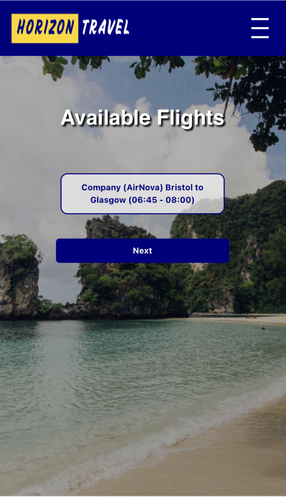

# 📚 About This Project

This project was originally developed as part of a university assignment at the University of the West of England (UWE) 🏫 and is now shared as part of my personal portfolio and resume.

🛠️ It's here to showcase my work and to help others learn — you're welcome to explore the structure, coding style, and problem-solving approach for educational purposes.

🚫 Please don’t copy or submit it as your own — that would go against academic integrity policies and could be considered plagiarism.

👍 Feel free to use it for inspiration, learn from it, and use what you learn to build something even better!

<br>
<br>

# ✈️ Horizon Travel | Air Booking System

### 🌍 Overview

Horizon Travel is a sleek and user-friendly web application designed to simplify flight booking within the UK. Users can easily search for and book flights to various destinations with confidence and ease. The system prioritizes reliability and efficiency for a seamless travel experience.

<br>

## Features


### For Customers  🧳:

## ✈️ Route Display & Selection:

🔍 Show available flight routes based on user search (departure, destination, date).<br>
🔄 Allow users to change departure, destination, and date.


## 💺 Seat Selection & Availability:

🎫 Let users choose between Economy and Business class. <br>
⚠️ If selected seats are insufficient, notify the user about available seats.

## 📄 Ticket Management:

👀 Users can view, generate, and cancel tickets.<br>
💸 Apply cancellation discount rules (if applicable).<br>
⏰ No late updates allowed after a certain cutoff time.

## 🧺 Shopping Basket:

🛒 Users can hold selected flights in a basket before finalizing the booking.

📝 Users can update their personal details. <br>
🔐 Create passwords for login during the sign-up process. Users can log in later using their credentials. <br>
🔑 Users can view prices and select seats without logging in, but they must log in to complete the booking.

## 💵 Price & Class Options:

📊 Display dynamic pricing based on Economy/Business class selection. <br>


<br>
<br>

### For Administrators  👨‍💻:


👤 Admins have the same access and validation rules as regular users ✈️.<br>

🧭 They also have an extra control panel to:<br>
➕ Add / ✏️ Update / ❌ Remove journeys, users, and prices <br>
📋 View and manage all bookings📊 Generate reports like top customers and sales per journey. <br>
📈 Include graphs for insights and expense comparisons. 

<br>
<br>


# Data Validation & Security

✅ Data validation ensures accurate inputs, secure actions, and proper handling of seats, tickets, and prices across all sections (including adding, updating, or removing items). <br>

🔒 Password Hashing: Passwords are securely hashed using industry-standard algorithms (e.g., bcrypt) to ensure that even if the database is compromised, user credentials remain protected. <br>

🛡️ Cross-Site Scripting (XSS) Prevention: All user input is sanitized and validated to prevent malicious scripts from being executed in the browser. This ensures that users cannot inject harmful JavaScript into the system, protecting both customer and admin data. <br>

🔑 Session Management: Secure session handling using tokens to prevent unauthorized access, with automatic expiration after a set time or inactivity period.

<br>
<br>


# 💻 Technology

🐍 Python Flask <br>
🌐 HTML / CSS <br>
🎨 Font Awesome Icons <br>
🎀 Bootstrap 5 <br>
⚙️ JavaScript <br>
🗃️ MySQL <br>
📅 Flatpickr (Date picker calendar) <br>
📊 Chart.js (Graphs and reports)

<br>
<br>

# 🛠️ System Requirements

🐍 Python 3.10.5+ (with pip3) <br>
🗄️ MySQL Server

<br>
<br>


# 📸 Screenshots

### 🏠 Home page


### 👤 Account page


### 📅 Availability page on phone screen


### 🛎️ Booking page


### ⚙️ Control page


### 📝 Register page


<br>
<br>

# 🗃️ Database Setup

### <br>🧱 First: Create the 'Horizon_travel' database if it doesn't exist
### 📥 Second: Import the SQL file into the 'Horizon_travel' database


**<br>🍎macOS**


```
/usr/local/mysql/bin/mysql -u Username -p -e "CREATE DATABASE IF NOT EXISTS \`Horizon_travel\`;"

/usr/local/mysql/bin/mysql -u Username -p Horizon_travel < horizon_travel.sql
```


**<br>🪟Windows**

"C:\Program Files\MySQL\MySQL Server 8.0\bin\mysql" -u Username -p -e "CREATE DATABASE IF NOT EXISTS `Horizon_travel`;"

"C:\Program Files\MySQL\MySQL Server 8.0\bin\mysql" -u Username -p Horizon_travel < horizon_travel.sql


**<br>🐧Linux** 

/usr/bin/mysql -u Username -p -e "CREATE DATABASE IF NOT EXISTS \`Horizon_travel\`;"

/usr/bin/mysql -u Username -p Horizon_travel < horizon_travel.sql

<br>
<br>


# 🚀Running the web Application

# start flask application

cd website/flask

python3 app.py

After starting the server, visit (http://127.0.0.1:5000) to access the web application.

<br>
<br>

# 🔐 Admin Access

📧 Username: admin@yahoo.com
🔑 Password: admin@@2


